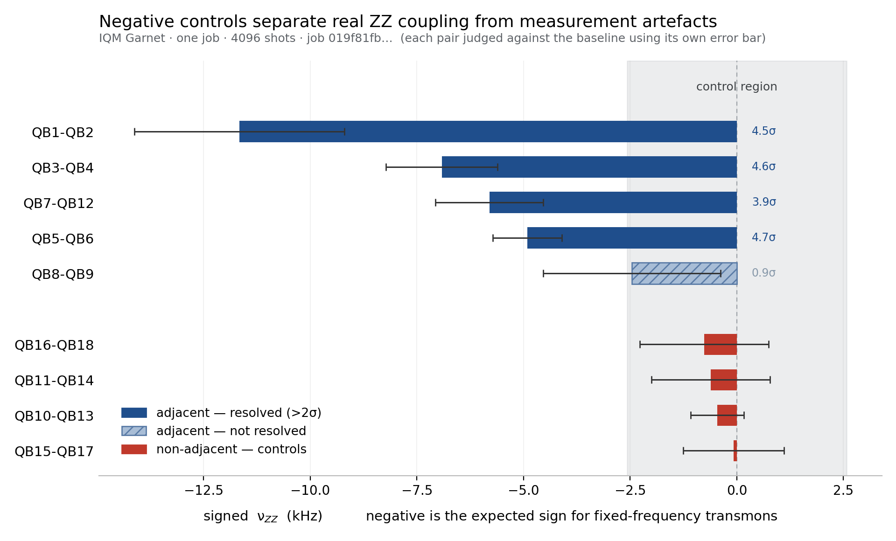

# nu_zz_map_iqm

**Residual ZZ coupling mapping for IQM quantum processors — with a built-in negative control.**

One job. Every edge. A control that tells you whether the numbers are real.



Parallel crosstalk characterisation is established practice — see Murali et al.
(ASPLOS 2020), Sarovar et al. (Quantum **4**, 321), Ketterer & Wellens
(Phys. Rev. Applied **20**, 034065). This is not a new method. It is a working
implementation for IQM hardware, where no equivalent tool was available, with
the negative control promoted from a good practice to a mandatory part of every
output.

---

## What this does

Residual ZZ coupling (`ν_ZZ`) is an always-on interaction between neighbouring
qubits in superconducting processors. It shifts phases during idle windows and
limits the depth of any circuit that leaves qubits waiting.

IQM's published calibration data reports gate fidelities, readout error and
coherence times — but **not** ZZ coupling. Full calibration sets for both
devices confirm this: Garnet (360 observations) and Emerald (980 observations),
both retrieved 2026-07-20, contain single- and two-qubit gate fidelities,
readout error and QND-ness, T1, T2 and T2-echo — and no ZZ metric of any kind.
If you want to know the ZZ map of the chip you are running on, you have to
measure it yourself.

This tool measures it. In a single job, for every edge it can reach, with a
sign, an error bar, and — critically — a negative control.

---

## Why the negative control matters

A differential measurement can produce a plausible-looking number even when
nothing real is being measured. Excited control qubits relax, preparation errors
shift both branches together, and the result is a smooth systematic offset that
looks exactly like a coupling.

The only way to tell the difference is to measure pairs that **cannot** be
coupled, in the same job, with the same circuits.

This tool always does that. It reserves qubits for non-adjacent pairs (graph
distance ≥ 2, no direct coupler) and reports them alongside the real edges.
Their mean and spread become the baseline; only adjacent pairs that exceed it
are reported as coupled.

If the controls come back at the same magnitude as the adjacent pairs, the
measurement is telling you about your own apparatus, not the chip. The tool says
so and stops.

---

## Method

Signed differential Ramsey.

```
control = |0⟩ or |1⟩
target  : H — delay(τ) — [Sdg for Y basis] — H — measure
```

Both X and Y bases are measured, giving a complex amplitude `z = ⟨X⟩ + i⟨Y⟩` for
each control state. The differential phase

```
Δφ(τ) = arg( z_on · conj(z_ref) )
```

has slope `2π·ν_ZZ` against τ, extracted by weighted least squares with
shot-noise weights. **The sign is preserved** — a magnitude-only measurement
cannot distinguish a real coupling from a systematic drift.

Disjoint edges are packed into the same circuit and read out on separate
classical bits, so the whole map costs one job rather than one job per pair.

### What the difference cancels, and what it does not

Taking the argument of a ratio removes *multiplicative* corruption — the
target's own dephasing, contrast loss, and any symmetric readout scaling divide
out exactly. It does **not** remove *additive* corruption, because
`arg(z + c) ≠ arg(z)`. Two effects therefore survive:

- **Asymmetric readout error.** Only the asymmetric part leaks; the symmetric
  part is a scale factor and cancels. On Garnet (`e01 ≈ 1.5%`, `e10 ≈ 0.8%`) the
  residual offset is about 0.7% of the amplitude, propagating to roughly
  0.1 kHz — below the resolution of the measurement. On a device with strongly
  asymmetric readout this would not be negligible.

- **Relaxation of the excited control.** When the control decays from |1⟩ to |0⟩
  the coupling stops for the remainder of the delay, so less phase accumulates
  than the true `ν_ZZ` would give. This is a one-directional bias:
  **the reported values are lower bounds.** Using the measured calibration
  (Garnet `T1 = 33.9 µs`, `τ_max = 18.5 µs`; Emerald `T1 = 52.0 µs`,
  `τ_max = 33.3 µs`) the slope-weighted mean survival is 0.66 and 0.61
  respectively, so **measured values run roughly 35–40% below the true
  coupling.** The sign and the ordering of edges are unaffected, and the factor
  is similar across pairs on the same device.

---

## Install

```
pip install qiskit iqm-client numpy scipy
```

If you previously installed the deprecated `qiskit-iqm` package, remove it first
(`pip uninstall qiskit-iqm`) — the Qiskit adapter now ships inside `iqm-client`
and the import path `iqm.qiskit_iqm` is unchanged.

## Run

Always self-test first — it costs nothing:

```
python nu_zz_map_iqm.py --sim garnet
python nu_zz_map_iqm.py --sim emerald
```

Then hardware:

```
python nu_zz_map_iqm.py garnet
python nu_zz_map_iqm.py emerald
```

The token is requested at runtime, or read from the `IQM_TOKEN` environment
variable. Results are written to `results/YYYYMMDD/` with the job ID.

Adding a device is three lines in `DEVICES` — URL, qubit count, median T2 and
T1. The coupling map, pair selection and τ range follow automatically.

---

## Reading the output

```
        pair        (IQM) |     type |      nu_ZZ (kHz) | contrast
  --------------------------------------------------------------------------
      (0, 1)      QB1-QB2 | adjacent |  -11.657 +/- 2.463 |    0.193
     (9, 12)    QB10-QB13 |  control |   -0.458 +/- 0.627 |    0.510
==============================================================================
  control baseline : -0.444 +/- 0.487 kHz (0.91 sigma from zero)
  test             : each pair vs baseline, using its own error

        (0, 1)  -11.657 +/- 2.463 kHz  * coupled          (4.5 sigma)
        (7, 8)   -2.458 +/- 2.075 kHz    not distinguishable (0.9 sigma)

  -> REAL DIRECT ZZ: 4/5 adjacent pairs are resolved above the control
     baseline. The remainder need more shots or a longer T2.
```

**Qubit numbering.** Pairs are reported as zero-based indices from the coupling
map. IQM labels the same qubits from 1, so `(0, 1)` is `QB1-QB2` and `(7, 8)` is
`QB8-QB9`. Both forms appear in the console output and in the JSON.

- **control baseline** — where zero actually sits for this apparatus, today.
  Reported as a weighted mean with its standard error, so you can see whether
  the apparatus has a real offset or is simply noisy.
- **per-pair test** — each adjacent pair is compared to the baseline using
  **its own** error bar: `|ν_ZZ − base| / √(err² + base_se²) > 2σ`. A single
  global threshold would hide the fact that a pair with a wide error bar can
  sit far from zero and still be unresolved.
- **contrast** — surviving fringe amplitude at the longest τ. Low contrast means
  short T2 on that pair and a correspondingly larger error bar.

Three verdicts:

| Verdict | Meaning |
|---|---|
| **Real coupling** | Controls near zero, adjacent pairs above threshold. The map is usable. |
| **Common systematic** | Controls offset in one direction. Subtract it, or fix the preparation. |
| **Unresolved** | Nothing exceeds the baseline. τ range or coherence is insufficient. |

---

## What the map is for

A ZZ map is not a curiosity. It tells you, quantitatively, how much phase error
your circuit accumulates while qubits sit idle — and which qubits to use to
avoid it. The numbers below are the actual Garnet measurement.

### 1. Phase error per idle window

`φ_error = π · ν_ZZ · τ_idle` when the neighbouring qubit is in |1⟩.

| pair | ν_ZZ | τ=0.5 µs | 1 µs | 2 µs | 5 µs |
|---|---|---|---|---|---|
| QB1-QB2 | 11.21 kHz | 0.018 | 0.035 | 0.070 | 0.176 |
| QB3-QB4 | 6.47 | 0.010 | 0.020 | 0.041 | 0.102 |
| QB7-QB12 | 5.36 | 0.008 | 0.017 | 0.034 | 0.084 |
| QB5-QB6 | 4.47 | 0.007 | 0.014 | 0.028 | 0.070 |
| QB8-QB9 | (unresolved) | — | — | — | — |

Radians. A coherent phase error of 0.1 rad is already visible in most
algorithms; it does not average away with more shots.

### 2. How many idle windows you can afford

Number of 1 µs idle windows before 0.1 rad accumulates:

| pair | windows |
|---|---|
| QB1-QB2 | **3** |
| QB3-QB4 | 5 |
| QB7-QB12 | 6 |
| QB5-QB6 | 7 |
| QB8-QB9 | (unresolved) |

Same chip, same day, a factor of 2.4 between the noisiest and quietest
*resolved* edge — and QB8-QB9 may be quieter still, if more shots resolve it. If your
circuit leaves qubits waiting — mid-circuit measurement, conditional operations,
uneven gate scheduling — this is the difference between a usable result and a
scrambled one.

### 3. Choosing where to run

Rank the edges and place idle-heavy parts of the circuit on the quiet ones. On
this Garnet snapshot, QB5-QB6 accumulates 2.4× less phase error than QB1-QB2,
and QB8-QB9 is quieter than anything the measurement could resolve. No
published calibration data would have told you that.

### 4. Compensating what you cannot avoid

Insert `Rz(−π · ν_ZZ · τ)` on the target after an idle window, conditioned on
the neighbour being excited:

| pair | τ=1 µs | 2 µs | 5 µs |
|---|---|---|---|
| QB1-QB2 | −0.035 | −0.070 | −0.176 |
| QB3-QB4 | −0.020 | −0.041 | −0.102 |
| QB5-QB6 | −0.014 | −0.028 | −0.070 |

Coherent error is systematic, so this subtraction works — unlike shot noise,
which you can only average down.

### 5. What the error bar permits

The relative error decides what the number is good for:

| relative error | use it for |
|---|---|
| **< 15%** | compensation — the correction is meaningful |
| **15–40%** | ranking edges — trust the ordering, not the value |
| **> 40%** | presence or absence only |

In the Garnet run, four edges fall in the 18–24% band (usable for ranking) and
QB8-QB9 at 103% does not clear the baseline at all. If you need
compensation-grade numbers, raise the shots or move to a device with longer T2.

### 6. Predicting the optimal delay

If you are using the feedforward framework of the Phase-Invariant paper
(DOI [10.5281/zenodo.19593677](https://doi.org/10.5281/zenodo.19593677)), the
optimal storage time follows directly from the map:

```
τ* = φ* / (π · ν_ZZ),    φ* ≈ 0.873 rad
```

The τ\* column in the measured example below is computed this way. Note that on
these devices τ\* often exceeds T2 for weakly coupled pairs — the value is
reported for reference, not because it is reachable.

### 7. Tracking drift

ZZ coupling moves. Re-running the map costs one job, so it can be repeated
before a long experiment rather than assumed from last week's calibration.

---

## Measured example — IQM Garnet, 2026-07-21

`job_id 019f81fb-458f-7662-874e-f6276e689f60`, 4096 shots, τ = 2–18.9 µs,
40 circuits, one job. Device calibration that day: T1 = 33.9 µs, T2 = 8.4 µs,
T2-echo = 19.5 µs, CZ error 0.66%, 30 edges (medians).

**Negative controls**

| pair | ν_ZZ (kHz) |
|---|---|
| QB10-QB13 | −0.458 ± 0.627 |
| QB11-QB14 | −0.614 ± 1.390 |
| QB15-QB17 | −0.076 ± 1.179 |
| QB16-QB18 | −0.764 ± 1.513 |

Weighted mean **−0.444 ± 0.487 kHz**, i.e. 0.91σ from zero. A sign test on four
negative values gives a one-sided p of 0.063. Consistent with no coupling,
though a small common offset of a few tenths of a kHz cannot be excluded — and
asymmetric readout is expected to contribute at roughly that scale.

**Adjacent edges**, each tested against the baseline with its own error bar:

| pair | ν_ZZ (kHz) | significance | τ\* (µs) |
|---|---|---|---|
| QB1-QB2 | −11.657 ± 2.463 | 4.5σ | 24.8 |
| QB3-QB4 | −6.915 ± 1.309 | 4.6σ | 42.9 |
| QB7-QB12 | −5.801 ± 1.268 | 3.9σ | 51.9 |
| QB5-QB6 | −4.910 ± 0.809 | 4.7σ | 62.2 |
| QB8-QB9 | −2.458 ± 2.075 | **0.9σ** | — |

**Four of five edges are resolved.** QB8-QB9 sits further from zero than any
control, but its own error bar (±2.075, 103% relative) is wide enough that it
cannot be separated from the baseline. It is reported, not confirmed.

This is exactly what the per-pair test exists to catch. A global threshold
based only on the spread of the controls would have counted it as coupled —
and the tool would have handed over a number that its own error bar does not
support.

All adjacent values are negative, which is the expected sign for
fixed-frequency transmons with negative anharmonicity. Without the control this
would be indistinguishable from a systematic offset — which is precisely the
failure mode the control exists to catch.

Resolved couplings on this run span **4.9 to 11.7 kHz**; the controls span
**0.08 to 0.76 kHz**.

---

## Cost

Measured on IQM Resonance, open plan, Garnet:

| Run | Configuration | Credits |
|---|---|---|
| 1 | 8 adjacent + 1 control, 40 circuits, 4096 shots | **26.00** |
| 2 | 5 adjacent + 4 controls, 40 circuits, 4096 shots | **26.00** |

The cost is set by circuit count and shots, not by how many pairs are packed in
— which is the whole point of packing them. Both runs mapped a different slice
of the chip for the same price.

To reduce it: `SHOTS = 2048` roughly halves the cost and widens the error bars
by about 1.3×. `N_TAU = 8` saves a further 20% at some loss of slope precision.
Going below 2048 shots is not recommended; at 1024 the error on Garnet reaches
~1.1 kHz, comparable to the couplings being measured.

**Is it worth it?** Break-even is around a 26-credit follow-up experiment. If
what comes after the map is smaller than that, measure the one pair you care
about instead. If you are running a long campaign with idle-heavy circuits, one
job to stop guessing is cheap.

Run `--sim` first. It is free and catches configuration mistakes before they
cost anything.

---

## Choosing τ

The τ range is set automatically to `2.2 × T2`. This is not arbitrary: with
decay included, the extraction error is flat between 2.0× and 2.5× T2 and rises
on both sides. Too short and the lever arm is insufficient; too long and the
fringe has decayed below the shot noise.

| τ_max | Garnet (T2 = 8.4 µs) | Emerald (T2 = 15.1 µs) |
|---|---|---|
| 1.0 × T2 | 0.89 kHz | 0.34 kHz |
| 1.5 × T2 | 0.59 | 0.25 |
| **2.0 × T2** | **0.58** | **0.24** |
| **2.5 × T2** | **0.57** | 0.32 |
| 3.0 × T2 | 0.82 | 0.46 |
| 5.0 × T2 | 1.23 | 0.51 |

Median absolute error, 4096 shots, ν_ZZ = 1.5–39 kHz.

**A spin echo would not help.** Echoing the target refocuses the ZZ phase along
with everything else and removes the signal. The coherence limit here is real.

---

## Limitations

- **Resolution is bounded by T2.** Roughly 1 kHz on Garnet, 0.4 kHz on Emerald
  at 4096 shots. Couplings below that are not resolvable on these devices.
- **Magnitudes are lower bounds.** Control relaxation during the delay
  suppresses accumulated phase (see Method). Expect roughly 35–40%
  underestimation on current IQM devices. Comparisons between edges on the same
  device remain valid; absolute values do not.
- **Phase unwrapping sets an upper limit.** Adjacent τ points must not differ by
  more than π, i.e. `ν_ZZ < 1/(2·Δτ)`. With the default sampling this is
  **266 kHz on Garnet** and **144 kHz on Emerald** — far above anything these
  devices exhibit, but a strongly coupled processor would need more τ points.
- **τ\* is reported for reference only.** For weakly coupled pairs it exceeds T2
  and cannot be reached in practice.
- **`--sim` validates the extraction, not the physics.** It injects an ideal
  phase; it cannot tell you whether the delay behaves as expected on hardware,
  whether spectators contribute, or whether leakage is present.
- **Not tested beyond Garnet and Emerald.** Other IQM devices should work via
  the automatic coupling map, but this is untested.

---

## Citation

If this tool contributes to your work, please cite it and get in touch — the
measurement has details worth discussing before you rely on the numbers.

```
Takeshi Okuda, "nu_zz_map_iqm: residual ZZ mapping with negative control
for IQM quantum processors", 2026.
https://github.com/okudat9/nu-zz-map-iqm
ORCID: 0009-0006-7449-202X
```

## License

Apache License 2.0. Free for any use, including commercial.

If you build on this in a way that matters to you, I would like to hear about it
— not as a condition, just because the measurement has details worth discussing
before you rely on the numbers.

---

## Related work

The measurement principle is standard and the parallel packing is not new:

- Murali, McKay, Martonosi & Javadi-Abhari, *Software Mitigation of Crosstalk on
  NISQ Computers*, ASPLOS 2020 — parallel characterisation on IBM, two orders of
  magnitude faster than all-pairs measurement.
- Sarovar, Proctor, Rudinger, Young, Nielsen & Blume-Kohout, *Detecting
  crosstalk errors in quantum information processors*, Quantum **4**, 321 (2020).
- Rudinger et al., *Experimental characterization of crosstalk errors with
  simultaneous gate set tomography*, PRX Quantum **2**, 040338 (2021).
- Ketterer & Wellens, *Characterizing crosstalk of superconducting transmon
  processors*, Phys. Rev. Applied **20**, 034065 (2023).

What this repository adds is not a method but an artefact: something that runs
on IQM hardware today, reports a signed coupling with an error bar, and refuses
to hand you a number without a control to judge it against.

---

## Background

The measurement grew out of a series of Bell-state and ZZ experiments on IBM
Heron and IQM devices:

- Bell Decay Clock — [10.5281/zenodo.19367565](https://doi.org/10.5281/zenodo.19367565)
- Phase-Invariant Condition — [10.5281/zenodo.19593677](https://doi.org/10.5281/zenodo.19593677)
- Hidden structure in Bell-state dynamics — [10.5281/zenodo.20457792](https://doi.org/10.5281/zenodo.20457792)
- From Fourier Components to Response Functions — [10.5281/zenodo.20961679](https://doi.org/10.5281/zenodo.20961679)

The negative control is not an afterthought. An earlier scan on IBM hardware
returned 24 negative values out of 24 edges — with no control to compare
against, there was no way to tell a real chip-wide ZZ pattern from an
instrumental artefact. That ambiguity is what this tool is built to remove.
